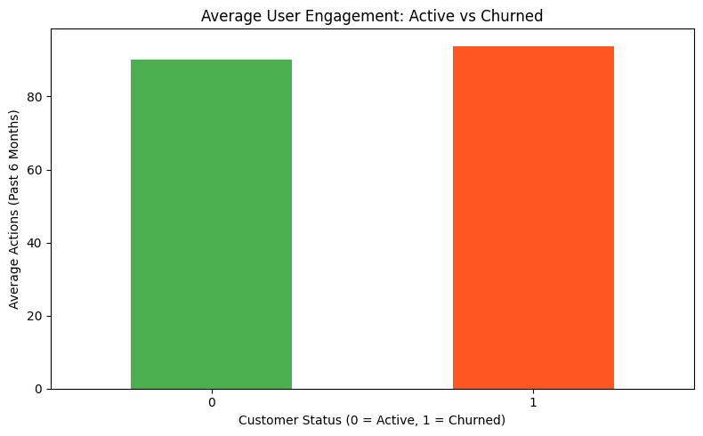
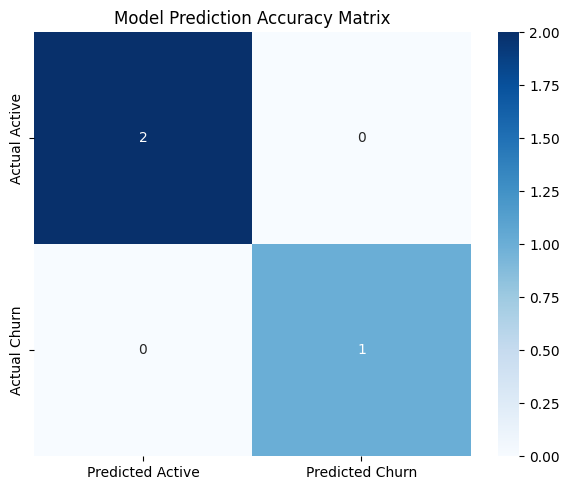

# CUSTOMER CHURN ANALYSIS & PREDICTIVE MODELING

## OVERVIEW
The goal of this assignment is to analyze raw customer activity logs, establish an operational timeline metric for subscription cancellations, and build an insulated machine learning pipeline to identify profiles at risk of attrition.

## VISUAL DATA INSIGHTS
### 1. User Engagement Patterns

### 2. Predictive Performance Evaluation (Confusion Matrix Heatmap)

## CORE ACTIONS TAKEN
* **Chronological Event Isolation**: Sorted user interaction lines sequentially by signup dates to strictly prevent predictive data leakage.
* **Temporal Boundary Resolution**: Implemented a 90th percentile threshold across log intervals to build a strict 90-day (3-month) operational rule for churn.
* **Binary Feature Vectorization**: Organized active states into clean machine learning metrics (`1` for Churn threat, `0` for Retained state).
* **Insulated Classifier Deployment**: Used a non-shuffled train/test division sequence (`shuffle=False`) to train a Random Forest model with a custom accuracy heatmap.

## OPERATIONAL MATRIX

| Data Element / Tool | Functional Purpose | Technical Implementation |
| :--- | :--- | :--- |
| **Chronological Sorting** | Prevents future data leakage | `df.sort_values(by='signup_date')` |
| **Train/Test Isolation** | Preserves historical sequence | `train_test_split(..., shuffle=False)` |
| **RandomForest** | Evaluates non-linear user trends | Binary classification model training |

## PROJECT ASSETS
* `dataset.csv`: Anonymized historical user interaction logs spreadsheet.
* `churn_query.sql`: Structural SQL query file calculating threshold percentiles.
* `churn_analysis.py`: Main Python machine learning training engine script.
* `churn_engagement_chart.png`: Visual engagement bar graph asset.
* `model_analysis_heatmap.png`: Visual model validation heatmap asset.
* `README.md`: Project documentation blueprint and status file.

**Project Completed By:** HARINI P  
**Role:** Data Analytics Intern  
**Project Track:** Task 2 Evaluation
